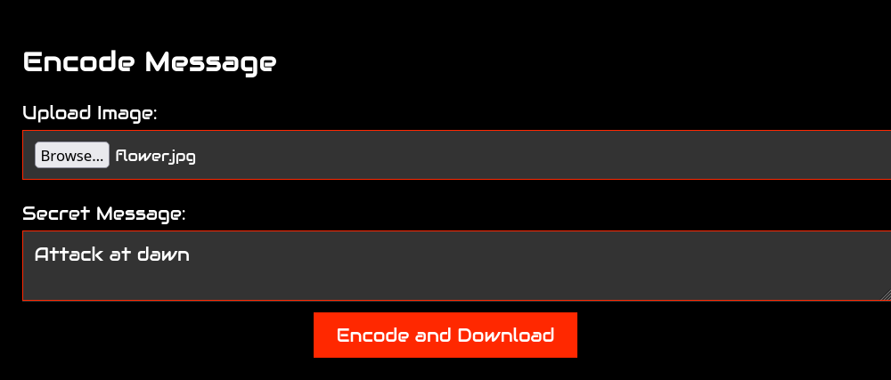
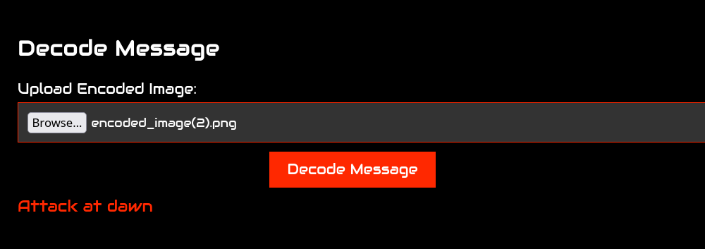

<p align="center">
  
</p>

# <p align="center">🖼️ Image Steganography using Flask</p>

---

## 📖 Overview

This project is a web-based **Image Steganography** application built with **Flask** and **Pillow (PIL)**. It allows users to:

- 🔒 Encode a secret message inside an image.
- 🔓 Decode the hidden message from an encoded image.
- 🌐 Use a simple web interface without requiring command-line interaction.

The application uses the **Least Significant Bit (LSB)** technique, where the least significant bit of each RGB pixel value is modified to store binary data while keeping visual changes nearly imperceptible.

---

## ✨ Features

- Encode text messages into PNG images.
- Decode hidden messages from encoded images.
- Simple and responsive Flask web interface.
- Fast image processing using Pillow.
- Lossless PNG output to preserve hidden data.
- End-of-message marker to ensure accurate decoding.

---

## 🛠️ Technologies Used

- Python 3
- Flask
- Pillow (PIL)
- HTML
- CSS
- JavaScript (Frontend)

---

## 📂 Project Structure

```
.
├── app.py
├── static
│   ├── script.js
│   └── style.css
└── templates
    └── index.html
```

---

## ⚙️ Installation

### 1. Clone the repository

```bash
git clone https://github.com/ronypradeep/PixelVault.git
```

### 2. Navigate to the project

```bash
cd PixelVault
```

### 3. Create a virtual environment (Optional)

```bash
python -m venv venv
```

Activate it:


```bash
venv\Scripts\activate     #windows
source venv/bin/activate  #linux/macOS
```

### 4. Install dependencies

```bash
pip install -r requirements.txt
```

### 5. Run the application

```bash
python app.py
```

Open your browser and visit

```
http://127.0.0.1:5000
```

---

# 🖥️ Application Screenshots

## Encoding a Secret Message

<p align="center">
  
</p>

---

## Decoding a Hidden Message

<p align="center">
  
</p>

---

# 🖼️ Before vs After Encoding

The encoded image looks almost identical to the original because only the least significant bits of the pixels are modified.

| Original Image | Encoded Image |
|---------------|---------------|
|  |  |

---

# 🔍 How It Works

### Encoding

1. Convert each character of the message into binary.
2. Append an **end marker (`11111110`)**.
3. Replace the least significant bit (LSB) of each RGB channel with the message bits.
4. Save the modified image as a PNG.

### Decoding

1. Read the least significant bit of every RGB value.
2. Group bits into bytes.
3. Stop when the end marker is reached.
4. Convert the binary data back into text.

---

## ⚠️ Limitations

- Works best with **PNG** images (lossless format).
- JPEG compression may destroy hidden data.
- Message size depends on image dimensions.
- Does not encrypt the message before hiding it.

---

<p align="center">
⭐ If you found this project useful, consider giving it a star!
</p>